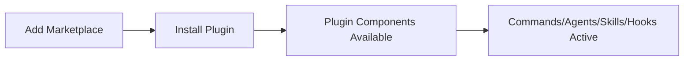

# Project Overview
Keywords: marketplace, plugins, claude-code, organization, team

## Purpose
A Claude Code plugin marketplace for team/organization use. Hosts custom plugins that extend Claude Code with commands, agents, skills, and hooks.

## Project Structure
```
claude-plugins/
├── .claude-plugin/
│   └── marketplace.json      # Marketplace registry (lists all plugins)
├── plugins/                   # Production plugins
│   └── {plugin-name}/        # Each plugin in its own folder
└── plugin-examples/          # Example/reference plugins
    ├── dev-tools/            # Example: development utilities
    └── git-workflow/         # Example: git automation
```

## Key Files
- `.claude-plugin/marketplace.json`: Plugin registry with name, source, description, version
- `CONTRIBUTING.md`: Plugin development guidelines
- `README.md`: Installation and usage instructions

## Installation Flow


Users add marketplace via `/plugin marketplace add` or `.claude/settings.json`, then install individual plugins.

## Rules
- MUST: Place production plugins in `plugins/` directory
- MUST: Register plugins in `.claude-plugin/marketplace.json`
- PREFER: Use `plugin-examples/` for reference implementations
- AVOID: Putting untested plugins directly in production
