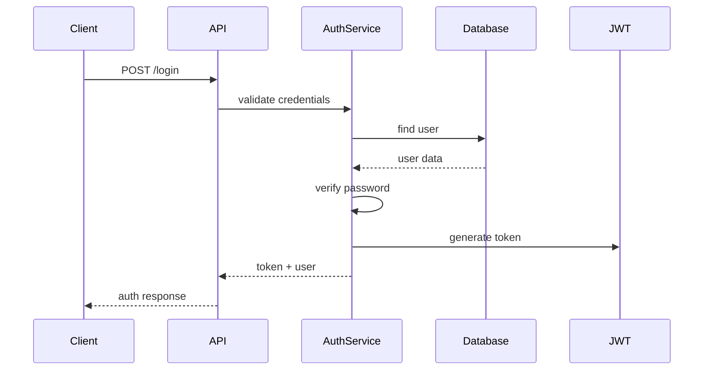

# Implement Specification

## Required Information

### Optional
- **spec**: Path to spec folder or plan file. Defaults to latest in `.agents/specs/` directory.
- **language**: Target programming language. Auto-detected from spec if not provided.
- **framework**: Framework to use. Auto-detected from spec if not provided.
- **review**: Review implementation plan before executing. Defaults to true.

If the user has specified a spec or folder, use that directly.

## Instructions

This skill works in two phases: detailed planning, then implementation.

### Phase 1: Detailed Implementation Planning

#### Action 1: Locate and Read Specification

If no spec path was provided:
**FIND** the latest specification folder in `.agents/specs/` (excluding implemented):
- **USE** your file discovery capabilities (glob, ls, or other tools)
- **IDENTIFY** the most recent spec folder
- **READ** the `2-plan.md` file in that folder

If spec path was provided:
**DETERMINE** the spec location:
- If it's a directory: read `[spec]/2-plan.md`
- If it's a file: read it directly

**READ** the specification for the purpose of:
- Extracting concrete implementation requirements and interfaces
- Identifying technical approach and architecture decisions
- Finding testable success criteria for validation
- Parsing BDD scenarios for test generation
- Understanding file structure and deployment requirements
- **DETECTING** existing "## Implementation Plan" section (if any)

**CHECK FOR EXISTING IMPLEMENTATION FILE**:
- **CHECK** if `3-implementation.md` exists in the same folder as plan
- **IF EXISTS**: Read it and review/refine based on user feedback
- **IF NOT EXISTS**: Must create implementation with detailed plan

#### Action 2: Create Detailed Implementation Plan

**Think thoroughly and in great detail** about architecting this solution.
Consider file structures, dependencies, integration points, and complex flows.

**GENERATE** a comprehensive implementation plan that includes:

**1. File Structure Tree**:
Use tree characters: ├── │ └── for structure
Each file is marked with operation: [A] = Add, [M] = Modify, [D] = Delete
Include description and dependencies.

**EXAMPLE**:
```md
src/
├── auth/
│   ├── oauth/
│   │   └── providers/
│   │       └── cognito.ts - [A] Cognito OAuth provider [axios]
│   └── config.ts          - [M] Add Cognito configuration
├── components/
│   └── LoginForm.tsx      - [A] Login UI component [react, formik]
└── .env.example           - [A] Environment configuration [dotenv]
```

**2. Mermaid Diagrams for Complex Flows**:


**3. Compact Pseudo-code for Each Component**:
```typescript
// src/services/authService.ts
class AuthService {
  async login(credentials) {
    // 1. Validate input
    // 2. Check user exists
    // 3. Verify password with bcrypt
    // 4. Generate JWT token
    // 5. Return token and user data
  }
}
```

**4. Task Checklist with Dependencies**:
```markdown
### Implementation Tasks
- [ ] Set up project structure and dependencies
- [ ] Create database schema for users
- [ ] Implement AuthService with login/register
- [ ] Create auth middleware for route protection
- [ ] Build LoginForm component
- [ ] Add auth routes to router
- [ ] Write integration tests
- [ ] Update API documentation
```

#### Action 3: Create Implementation File

**CREATE** `3-implementation.md` in the same folder as plan:

```markdown
# Detailed Implementation Plan
**Status**: draft
**Created**: [current date in ISO format]
**Language**: [detected or specified language]
**Framework**: [detected or specified framework]
**Plan**: [link to 2-plan.md]

## File Structure
[Tree format showing all files with operations [A]/[M]/[D], descriptions, and dependencies]

## Implementation Approach
[Specific technical decisions and patterns to follow]

## Technical Diagrams
[Mermaid diagrams for complex flows]

## Component Pseudo-code
[Compact pseudo-code for each major component]

## Task Checklist
[Ordered tasks with checkboxes]

## Dependencies
[Required libraries and their purposes]

## Integration Points
[How new code integrates with existing]
```

#### Action 4: Pre-Implementation Confidence Check

**EVALUATE** confidence in the detailed plan:
- Can you implement each file based on the pseudo-code?
- Are all integration points clear?
- Do you understand the task sequence?

If confidence < 0.8:
- **REFINE** the plan with more detail
- **ASK** user for clarification on specific gaps

**DISCOVER** project patterns for implementation alignment from context-prime results.

If review mode is enabled (default):
#### Action 5: Review Detailed Plan
**SHOW** the complete implementation content to the user:
- Display file structure
- Show pseudo-code for key components
- Present task checklist
- List dependencies

**ASK**: "Approve this detailed implementation plan? (y/n) or provide feedback:"

Based on response:
- If 'y': Proceed to Phase 2
- If 'n': Cancel implementation
- If feedback: Refine the plan and update implementation

### Phase 2: Code Implementation

#### Action 6: Implement Based on Detailed Plan
(After approval from Action 5 if review mode is enabled)

1. **UPDATE STATUS**:
   - **EDIT** the implementation file
   - Change `**Status**: draft` to `**Status**: in-progress`
   - Add `**Updated**: [current date in ISO format]`

2. **PROJECT SETUP**:
   - **CREATE** the directories specified in the file structure
   - **INITIALIZE** project files based on the plan
   - **INSTALL** dependencies listed in the plan

3. **IMPLEMENT FILES FROM PLAN**:
   - **FOR EACH FILE** in implementation:
     * **READ** the pseudo-code for that component
     * **IMPLEMENT** full working code based on pseudo-code
     * **MATCH** project patterns and conventions
     * **CREATE/EDIT** the file using appropriate capability
   - **UPDATE** implementation to check each task as completed

4. **QUALITY VALIDATION**:
   - Code follows patterns from the plan
   - All files match the pseudo-code structure
   - Dependencies are properly integrated
   - Code compiles/runs without errors

#### Action 7: Finalize Implementation
1. **UPDATE STATUS**:
   - **EDIT** the implementation file
   - Change `**Status**: in-progress` to `**Status**: completed`
   - Add `**Completed**: [current timestamp]`

2. **UPDATE CHECKLIST**:
   - Mark all completed tasks with [x] in implementation
   - Note any deviations from plan

#### Action 8: Suggest Next Steps
**SUGGEST**:
- "Run test-generate skill to create comprehensive tests"
- "Run formatting/linting commands if available"

## After Completion

**RESPOND** with:
- ✅ Implementation Complete
- List all created/modified files
- Show completed task checklist
- Suggest next steps (testing, formatting)

## Execution Reminder

**TWO-PHASE APPROACH**:

**PHASE 1 - Detailed Planning**:
1. READ the plan specification to understand requirements
2. CREATE detailed implementation plan with file breakdown and pseudo-code
3. CREATE implementation file with the detailed plan
4. GET approval before proceeding (if review mode enabled)

**PHASE 2 - Implementation**:
5. IMPLEMENT each file based on the detailed plan
6. CREATE all necessary files with full working code
7. UPDATE status and checklist in the spec

**REMEMBER**: First plan in detail, then implement. This ensures clear understanding before coding.

---

**IMPORTANT**: These are COMMANDS to EXECUTE. Use your file manipulation capabilities NOW.
